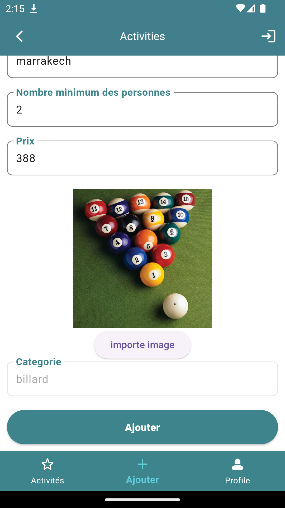
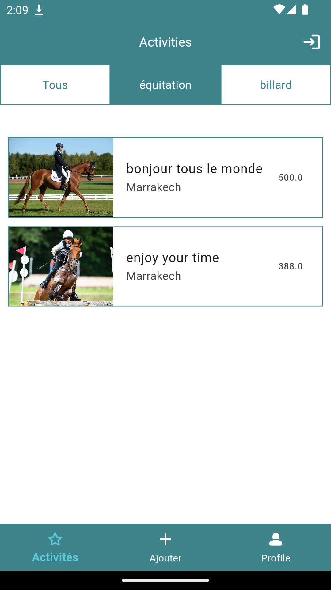

# application_des_activites_AI

## Plateforme de Test

L'application a été testée avec un émulateur Android.

## État des Lieux des US Développées

1. Interface de login

3. Liste des activités

4. Détail d’une activité

5. Ajouter une activité

6. Partie AI

7. Filtrer sur la liste des activités

9. Profil utilisateur et la déconnection

   
A few resources to get you started if this is your first Flutter project:

- [Lab: Write your first Flutter app](https://docs.flutter.dev/get-started/codelab)
- [Cookbook: Useful Flutter samples](https://docs.flutter.dev/cookbook)

For help getting started with Flutter development, view the
[online documentation](https://docs.flutter.dev/), which offers tutorials,
samples, guidance on mobile development, and a full API reference.
